# Plot Price Prediction
This repo contains the analysis & visualization of a dataset containing the prices & other attributes of plots in Pakistan. 
Plus, it contains results established using various classical machine learning algorithms as well as deep learning ANN models.
This contribution was made to a project at [TUKL-NUST Research & Development Lab.](https://tukl.seecs.nust.edu.pk/), 
during my internship.

## Description of Repo Files
- `PricePredictionModel-Rethought.ipyn` contains the implications of visualization & analysis along with the baseline results
using various ML models. Moreover, it describes the measures to validate & improve the dataset.
- `/images` contains plots & other images used in `PricePredictionModel-Rethought.ipyn`.
- `PlotPricePrediction-Visualization and Analysis.pptx` Presentation on this work.

-------

# Notebook Preview

## Imports & Basic Setup


```python
# Common imports
import sys
import os
import numpy as np
import pandas as pd

import seaborn as sns

%matplotlib inline
import matplotlib as mpl
import matplotlib.pyplot as plt
# To plot pretty figures
mpl.rc('axes', labelsize=14)
mpl.rc('xtick', labelsize=12)
mpl.rc('ytick', labelsize=12)

# Define directory to save the figures
PROJECT_ROOT_DIR = "."
IMAGES_PATH = os.path.join(PROJECT_ROOT_DIR, "images")
os.makedirs(IMAGES_PATH, exist_ok=True)

# function to save the figures
def save_fig(fig_id, tight_layout=True, fig_extension="png", resolution=300):
    path = os.path.join(IMAGES_PATH, fig_id + "." + fig_extension)
    print("Saving figure", fig_id)
    if tight_layout:
        plt.tight_layout()
    plt.savefig(path, format=fig_extension, dpi=resolution)

# To get same results during each run
np.random.seed(42)

# Ignoring useless warnings
import warnings
warnings.filterwarnings(action="ignore", message="^internal gelsd")
```


```python
import sklearn
from sklearn import preprocessing
from sklearn.model_selection import train_test_split
from sklearn.metrics import mean_squared_error

import tensorflow as tf
from tensorflow.keras.models import Sequential
from tensorflow.keras.layers import Dense
from tensorflow.keras import optimizers
from tensorflow.keras import losses
from tensorflow.keras.layers import Dropout
from tensorflow.keras import regularizers
```

## Dataset Setup


```python
df = pd.read_csv('dataset.csv')
df.shape
```


    (43628, 18)


```python
df.info()
```

    <class 'pandas.core.frame.DataFrame'>
    RangeIndex: 43628 entries, 0 to 43627
    Data columns (total 18 columns):
    id                  43628 non-null int64
    disc                43628 non-null object
    region              43628 non-null object
    cityID              43628 non-null int64
    area                43628 non-null float64
    price               43628 non-null int64
    Lat                 43628 non-null float64
    Lng                 43628 non-null float64
    bank                43628 non-null int64
    mosque              43628 non-null int64
    bus                 43628 non-null int64
    park                43628 non-null int64
    department_store    43628 non-null int64
    school              43628 non-null int64
    supermarket         43628 non-null int64
    cemetary            43628 non-null int64
    hospital            43628 non-null int64
    restaurant          43628 non-null int64
    dtypes: float64(3), int64(13), object(2)
    memory usage: 6.0+ MB
    


```python
# some region names end with comma, removing those commas
df['region'] = df['region'].str.strip(',')
df.shape
```


    (43628, 18)


```python
def cleanData():
    global df
    # Removing outliers
    indexNames = df[ (df['price'] >= 250000000 )].index
    df.drop(indexNames , inplace=True)
    print(df.shape)
    indexNames = df[(df['price'] <= 10000)].index
    df.drop(indexNames , inplace=True)
    print(df.shape)
    indexNames = df[(df['area']>= 1000)].index
    df.drop(indexNames , inplace=True)
    print(df.shape)
    indexNames = df[(df['area'] <= 3 )].index
    df.drop(indexNames , inplace=True)
    print(df.shape)
    
    # Removing places with the same latitude and longitude
    df.drop_duplicates(subset=['Lat','Lng'],keep='first',inplace = True)
    print(df.shape)
```


```python
cleanData()
df.head()
```

    (43591, 18)
    (43591, 18)
    (43590, 18)
    (43587, 18)
    (2158, 18)
    


<div>
<style scoped>
    .dataframe tbody tr th:only-of-type {
        vertical-align: middle;
    }

    .dataframe tbody tr th {
        vertical-align: top;
    }

    .dataframe thead th {
        text-align: right;
    }
</style>
<table border="1" class="dataframe">
  <thead>
    <tr style="text-align: right;">
      <th></th>
      <th>id</th>
      <th>disc</th>
      <th>region</th>
      <th>cityID</th>
      <th>area</th>
      <th>price</th>
      <th>Lat</th>
      <th>Lng</th>
      <th>bank</th>
      <th>mosque</th>
      <th>bus</th>
      <th>park</th>
      <th>department_store</th>
      <th>school</th>
      <th>supermarket</th>
      <th>cemetary</th>
      <th>hospital</th>
      <th>restaurant</th>
    </tr>
  </thead>
  <tbody>
    <tr>
      <th>0</th>
      <td>2</td>
      <td>7 Marla Plot for Sale.</td>
      <td>B-17</td>
      <td>1</td>
      <td>7.62400</td>
      <td>2300000</td>
      <td>33.669341</td>
      <td>72.844890</td>
      <td>1</td>
      <td>1</td>
      <td>0</td>
      <td>0</td>
      <td>0</td>
      <td>1</td>
      <td>1</td>
      <td>1</td>
      <td>1</td>
      <td>1</td>
    </tr>
    <tr>
      <th>16</th>
      <td>41</td>
      <td>5 Marla Residential Land for Sale in Islamabad...</td>
      <td>Top City-1</td>
      <td>1</td>
      <td>5.44504</td>
      <td>1000000</td>
      <td>33.586108</td>
      <td>72.866789</td>
      <td>1</td>
      <td>1</td>
      <td>0</td>
      <td>1</td>
      <td>0</td>
      <td>1</td>
      <td>1</td>
      <td>1</td>
      <td>1</td>
      <td>1</td>
    </tr>
    <tr>
      <th>29</th>
      <td>54</td>
      <td>600 Square Yard Plot for Sale</td>
      <td>F-16</td>
      <td>1</td>
      <td>21.60000</td>
      <td>5500000</td>
      <td>33.656936</td>
      <td>72.888470</td>
      <td>1</td>
      <td>0</td>
      <td>0</td>
      <td>0</td>
      <td>0</td>
      <td>1</td>
      <td>1</td>
      <td>1</td>
      <td>1</td>
      <td>1</td>
    </tr>
    <tr>
      <th>48</th>
      <td>74</td>
      <td>200 Square Yards Plot for Sale</td>
      <td>Faisal Hills</td>
      <td>1</td>
      <td>7.20000</td>
      <td>2185000</td>
      <td>33.729388</td>
      <td>73.093146</td>
      <td>1</td>
      <td>1</td>
      <td>1</td>
      <td>1</td>
      <td>1</td>
      <td>1</td>
      <td>1</td>
      <td>1</td>
      <td>1</td>
      <td>1</td>
    </tr>
    <tr>
      <th>57</th>
      <td>88</td>
      <td>10 Marla Plot for Sale</td>
      <td>Bahria Town</td>
      <td>1</td>
      <td>10.89200</td>
      <td>9500000</td>
      <td>33.692555</td>
      <td>73.219032</td>
      <td>1</td>
      <td>1</td>
      <td>0</td>
      <td>1</td>
      <td>0</td>
      <td>1</td>
      <td>1</td>
      <td>1</td>
      <td>1</td>
      <td>1</td>
    </tr>
  </tbody>
</table>
</div>


```python
df.describe()
# remaining dataset entries are 2158. 
```


<div>
<style scoped>
    .dataframe tbody tr th:only-of-type {
        vertical-align: middle;
    }

    .dataframe tbody tr th {
        vertical-align: top;
    }

    .dataframe thead th {
        text-align: right;
    }
</style>
<table border="1" class="dataframe">
  <thead>
    <tr style="text-align: right;">
      <th></th>
      <th>id</th>
      <th>cityID</th>
      <th>area</th>
      <th>price</th>
      <th>Lat</th>
      <th>Lng</th>
      <th>bank</th>
      <th>mosque</th>
      <th>bus</th>
      <th>park</th>
      <th>department_store</th>
      <th>school</th>
      <th>supermarket</th>
      <th>cemetary</th>
      <th>hospital</th>
      <th>restaurant</th>
    </tr>
  </thead>
  <tbody>
    <tr>
      <th>count</th>
      <td>2158.000000</td>
      <td>2158.000000</td>
      <td>2158.000000</td>
      <td>2.158000e+03</td>
      <td>2158.000000</td>
      <td>2158.000000</td>
      <td>2158.000000</td>
      <td>2158.000000</td>
      <td>2158.000000</td>
      <td>2158.000000</td>
      <td>2158.000000</td>
      <td>2158.000000</td>
      <td>2158.000000</td>
      <td>2158.000000</td>
      <td>2158.000000</td>
      <td>2158.000000</td>
    </tr>
    <tr>
      <th>mean</th>
      <td>27620.110287</td>
      <td>1.963855</td>
      <td>18.053462</td>
      <td>1.529253e+07</td>
      <td>32.572422</td>
      <td>73.643578</td>
      <td>0.863763</td>
      <td>0.501854</td>
      <td>0.246525</td>
      <td>0.495366</td>
      <td>0.401761</td>
      <td>0.994903</td>
      <td>0.995366</td>
      <td>0.981928</td>
      <td>0.988879</td>
      <td>0.982854</td>
    </tr>
    <tr>
      <th>std</th>
      <td>18338.542450</td>
      <td>0.999578</td>
      <td>30.080210</td>
      <td>2.349205e+07</td>
      <td>1.114469</td>
      <td>0.671395</td>
      <td>0.343120</td>
      <td>0.500112</td>
      <td>0.431087</td>
      <td>0.500094</td>
      <td>0.490368</td>
      <td>0.071230</td>
      <td>0.067931</td>
      <td>0.133244</td>
      <td>0.104894</td>
      <td>0.129844</td>
    </tr>
    <tr>
      <th>min</th>
      <td>2.000000</td>
      <td>1.000000</td>
      <td>3.267000</td>
      <td>3.300000e+05</td>
      <td>24.993758</td>
      <td>67.307440</td>
      <td>0.000000</td>
      <td>0.000000</td>
      <td>0.000000</td>
      <td>0.000000</td>
      <td>0.000000</td>
      <td>0.000000</td>
      <td>0.000000</td>
      <td>0.000000</td>
      <td>0.000000</td>
      <td>0.000000</td>
    </tr>
    <tr>
      <th>25%</th>
      <td>15779.500000</td>
      <td>1.000000</td>
      <td>7.623040</td>
      <td>4.000000e+06</td>
      <td>31.455539</td>
      <td>73.043821</td>
      <td>1.000000</td>
      <td>0.000000</td>
      <td>0.000000</td>
      <td>0.000000</td>
      <td>0.000000</td>
      <td>1.000000</td>
      <td>1.000000</td>
      <td>1.000000</td>
      <td>1.000000</td>
      <td>1.000000</td>
    </tr>
    <tr>
      <th>50%</th>
      <td>25207.500000</td>
      <td>1.000000</td>
      <td>10.890040</td>
      <td>7.575000e+06</td>
      <td>33.521323</td>
      <td>73.218711</td>
      <td>1.000000</td>
      <td>1.000000</td>
      <td>0.000000</td>
      <td>0.000000</td>
      <td>0.000000</td>
      <td>1.000000</td>
      <td>1.000000</td>
      <td>1.000000</td>
      <td>1.000000</td>
      <td>1.000000</td>
    </tr>
    <tr>
      <th>75%</th>
      <td>36617.250000</td>
      <td>3.000000</td>
      <td>21.780000</td>
      <td>1.650000e+07</td>
      <td>33.632623</td>
      <td>74.284503</td>
      <td>1.000000</td>
      <td>1.000000</td>
      <td>0.000000</td>
      <td>1.000000</td>
      <td>1.000000</td>
      <td>1.000000</td>
      <td>1.000000</td>
      <td>1.000000</td>
      <td>1.000000</td>
      <td>1.000000</td>
    </tr>
    <tr>
      <th>max</th>
      <td>66744.000000</td>
      <td>3.000000</td>
      <td>784.080000</td>
      <td>2.300000e+08</td>
      <td>33.744962</td>
      <td>74.499221</td>
      <td>1.000000</td>
      <td>1.000000</td>
      <td>1.000000</td>
      <td>1.000000</td>
      <td>1.000000</td>
      <td>1.000000</td>
      <td>1.000000</td>
      <td>1.000000</td>
      <td>1.000000</td>
      <td>1.000000</td>
    </tr>
  </tbody>
</table>
</div>


## Digging the Dataset and Visualizing to Gain Insights

### Histograms of Dataset Attributes


```python
df.hist(bins=50, figsize=(20,15))
save_fig("attribute_histogram_plots")
plt.show()
```

    Saving figure attribute_histogram_plots
    


    
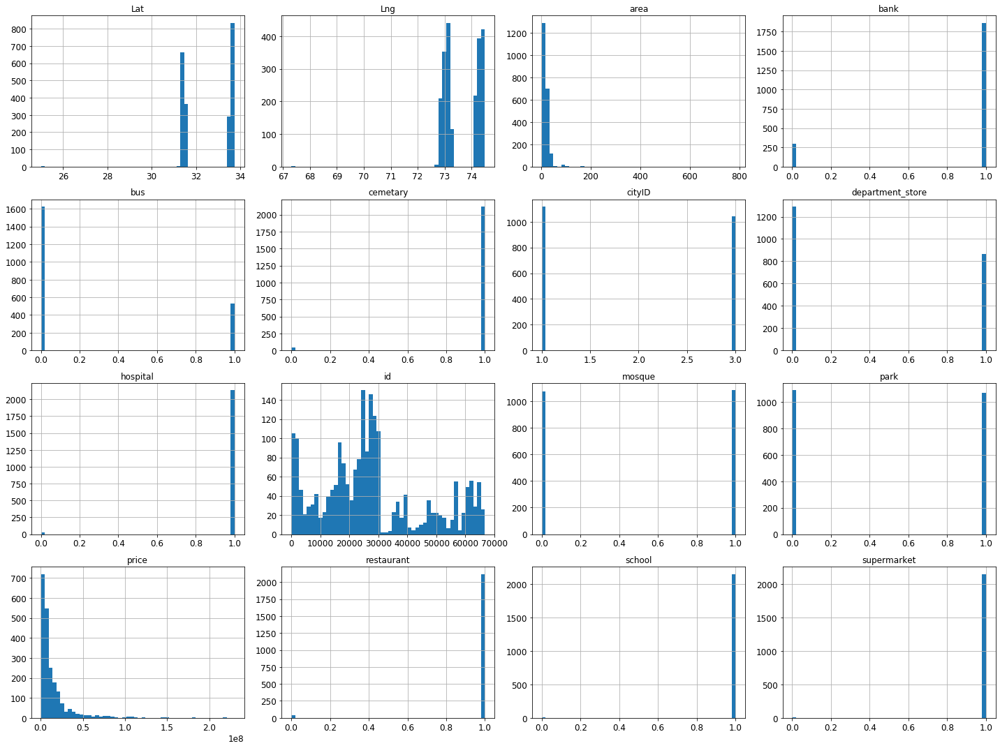
    


**Attribute Histograms without removing the duplicate (latitude, longitude) records:**
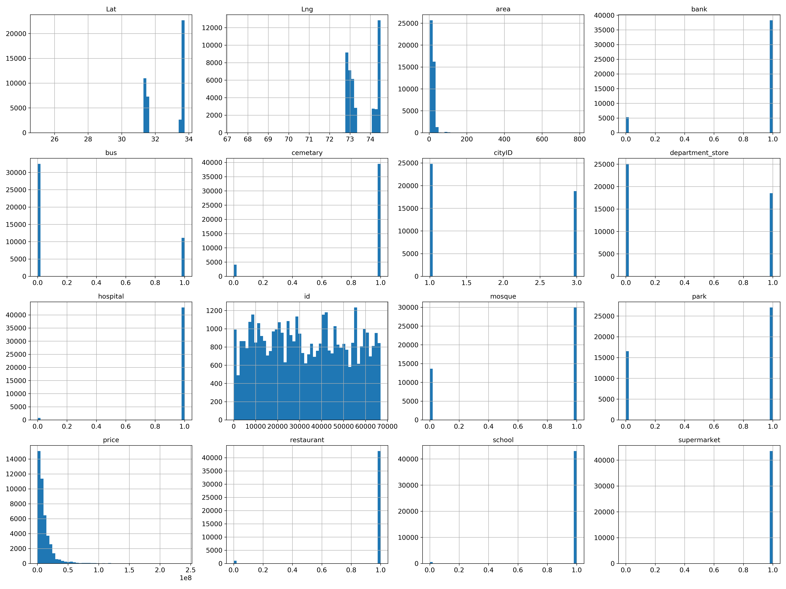


```python
df['price'].hist()
```


    <matplotlib.axes._subplots.AxesSubplot at 0x195d0c18cc0>


    
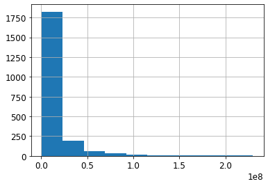
    


```python
df['bank'].hist()
```


    <matplotlib.axes._subplots.AxesSubplot at 0x195d7df3898>


    
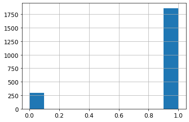
    


#### Observations and deductions from the Attribute Histograms
- **Most of variables are not continuous**. Variables are not suitable for predicting a continuous variable: price. So, binary attributes must be replaced with suitable continuous attributes. For example, **distance to bank, restaurant, school, and other places can be added to the dataset** instead of simply having a flag variable indicating their presence.

- **Useless Attributes**: *Cemetery, hospital, restaurant, school and supermarket* are present in almost all the records. So, these will not be helpful in predictive models. To increase generalizability of the model during test and deployment phase, records with absence of these places should be added to the dataset. Moreover, replacing current values (1 or 0) with distances can help in better use of current dataset.
    
- **Remaining potential attributes**: *Area, bank, bus, mosque, department_store and park* may prove helpful in predictive models. Nonetheless, adding more attributes will help with getting better results.


### Visualizing Attributes w.r.t Price

#### Area


```python
df.plot(kind="scatter", x="area", y="price",
             alpha=1)
save_fig("price_vs_area_scatterplot")
```

    Saving figure price_vs_area_scatterplot
    


    
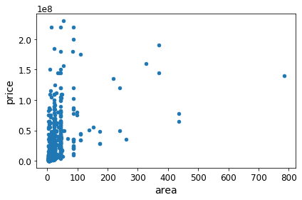
    


### Preprocessing Dataset


```python
# converting to string variable "region" to numerical variables 
df['region'] = pd.Categorical(df['region'])

dfDummies = pd.get_dummies(df['region'], prefix = 'category')
df = pd.concat([df, dfDummies], axis=1)
```

### Location Scatter Plots


```python
df.plot(kind="scatter", x="Lat", y="Lng")
save_fig("overall_scatter_plot")

```

    Saving figure overall_scatter_plot
    


    
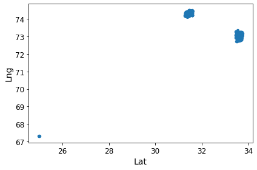
    


```python
df.plot(kind="scatter", x="Lng", y="Lat", alpha=1,
    figsize=(10,7),
    c="price", cmap=plt.get_cmap("jet"), colorbar=True,
    sharex=False)
plt.legend()
save_fig("housing_prices_scatterplot")
```

    WARNING: Logging before flag parsing goes to stderr.
    W1201 15:39:05.701071  6008 legend.py:1282] No handles with labels found to put in legend.
    

    Saving figure housing_prices_scatterplot
    


    
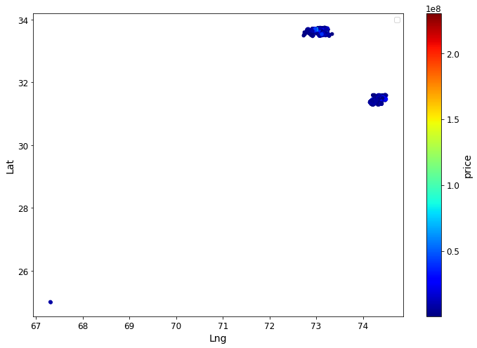
    


#### Implications of scatter plots:
- Dataset points are very closely placed. So, most of the entries are from the same or nearly situated towns/colonies. 
- **To better predict price differences in cities, attributes which count to difference of prices in cities should present in the dataset. There is not even a single such attribute in the dataset.**	
    - Possible new attributes to differentiate cities can be can be population, presence of people of certain social class (can be differentiated on the basis of their income, job, etc), presence of industries, number of malls, number of cinemas, number of parks, etc. 
    - Presence of places should be counted within a certain radius around the plots - preferably dataset should be collected with different radius values, best one can be found during training. Dataset collection with different radius values does not need much effort, same scraping algorithm can be used multiple times with little changes.
- Last but not the least, **to predict the price differences within the towns/colonies**, we need more attributes which count to differences in prices within same town, colony, or city. Currently, such attributes in the dataset are: area, bank, bus, mosque and park. Only area is a continuous variable here. Problems with the non-continuous variables are discussed earlier in "Attributes Histograms" section.


### Correlation Matrix and Plots


```python
corr_matrix = df.corr()
plt.subplots(figsize=(12,9))
sns.heatmap(corr_matrix, vmax=0.9, square=True)
save_fig("correlation_matrix_heatmap")
```

    Saving figure correlation_matrix_heatmap
    


    
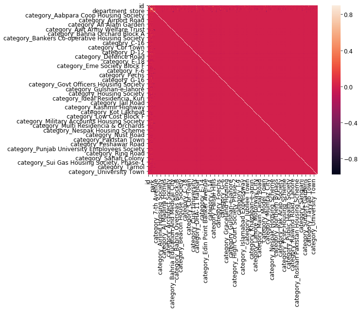
    


**Correlation matrix heatmap without converting region attribute to categorical variable:**
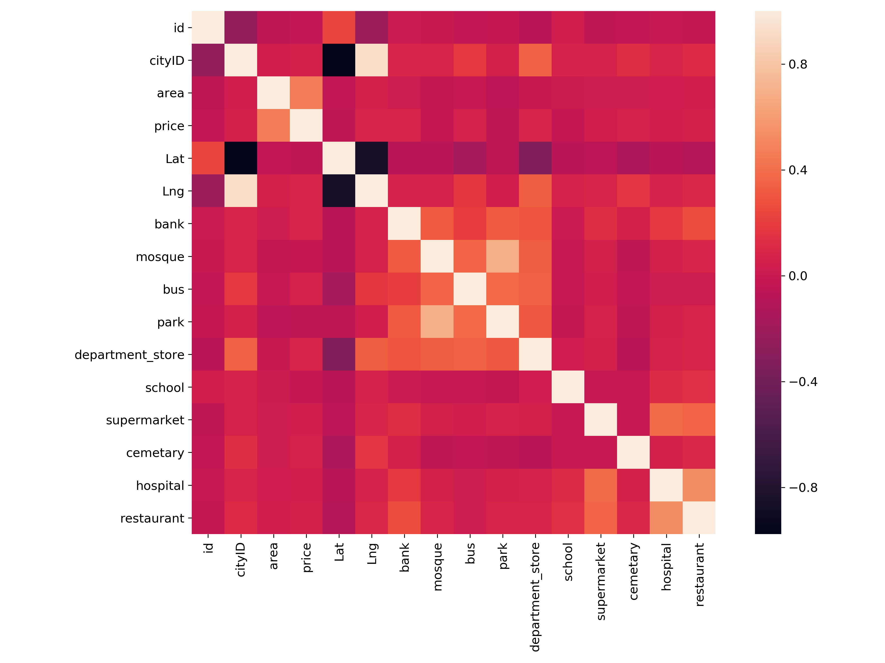

**Correlation Matrix without Category Variables**

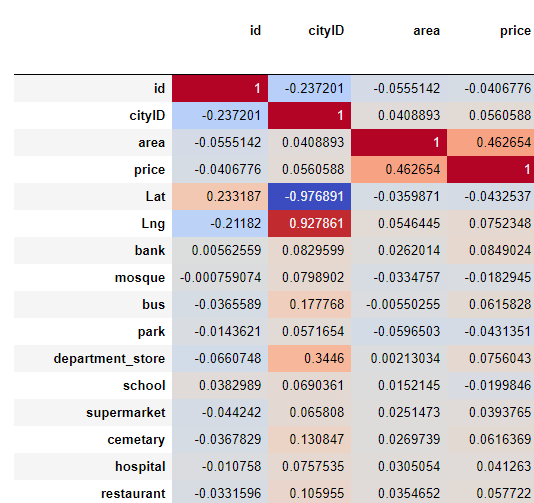


```python
# Run this to generate full correlation matrix. It needs significant processing and memory. 
# Chrome may become unresponsive due to the amount of output data
# corr_matrix.style.background_gradient(cmap='coolwarm', axis=None)
```


```python
corr_matrix["price"].sort_values(ascending=False)
```


    price                                  1.000000
    area                                   0.462654
    category_F-7                           0.282082
    category_F-8                           0.244955
    category_E-7                           0.196835
    category_Emporium Mall                 0.187667
    category_F-10                          0.174314
    category_F-11                          0.173792
    category_Peco Road                     0.169332
    category_DHA                           0.157106
    category_Japan Road                    0.132662
    category_Model Town                    0.128494
    category_Kalma Chowk Lahore            0.118910
    category_Tarlai                        0.114327
    bank                                   0.084902
    category_Ali Pur                       0.078118
    category_F-6                           0.077428
    department_store                       0.075604
    Lng                                    0.075235
    category_F-9                           0.069864
    category_Koral Chowk                   0.066197
    category_E-11                          0.064487
    category_Revenue Society               0.063905
    category_Pwd Housing Scheme            0.062385
    cemetary                               0.061637
    bus                                    0.061583
    category_I-8                           0.058287
    restaurant                             0.057722
    category_Mohlanwal Road                0.057488
    cityID                                 0.056059
                                             ...   
    category_I-15                         -0.028610
    category_Soan Garden                  -0.028661
    category_F-16                         -0.029860
    category_F-18                         -0.030197
    category_E-16                         -0.030511
    category_Top City-1                   -0.030555
    category_Capital Smart City           -0.030572
    category_E-12                         -0.031914
    category_F-17                         -0.032631
    category_E-17                         -0.033513
    category_Jinnah Garden                -0.033758
    category_Lda Avenue                   -0.035191
    category_E-19                         -0.036075
    category_I-12                         -0.037636
    category_Cbr Town                     -0.039286
    category_G-16                         -0.040106
    id                                    -0.040678
    category_Pechs                        -0.040794
    category_I-14                         -0.040902
    category_Fateh Jang Road              -0.041034
    category_State Life Housing Society   -0.041305
    category_University Town              -0.041393
    category_D-18                         -0.042296
    category_I-16                         -0.042367
    park                                  -0.043135
    Lat                                   -0.043254
    category_Ghauri Town                  -0.056375
    category_Bahria Town                  -0.060152
    category_B-17                         -0.061401
    category_Bahria Orchard               -0.065297
    Name: price, Length: 368, dtype: float64


#### Deductions from the correlations
- As expected, there is a strong correlation between the price and area.
- Category variables do not have considerable correlation with the prices. Because, area and other attributes are not being considered in correlation calculation.
- *Correlation of price with previously separated potential attributes (area, bank, bus, mosque, park) is insignificant*. **This points to possibility of defects in the dataset collection, selection of dataset attributes and default attribute values/types.** We can't certainly say that the correlation doesn't exist because there are other attributes affecting the price at the same time. For example, decrease in price is not significant due to absence of bank if the area of plot is high.
    
    **Presence of defects can be pointed out by** checking correlation between pair of attributes with the price. **For example**, *correlation between (mosque, area) and price should be checked*. One attribute in the pair should be area because it is most influential attribute in the dataset.


## Preprocessing Dataset for Predictive Models


```python
del_col_count = 4
X = df.drop(columns=['price','id','disc','region'])
Y = df[['price']]
```


```python
min_max_scaler = sklearn.preprocessing.MinMaxScaler()
X_scale = min_max_scaler.fit_transform(X)
```


```python
X_scale
```


    array([[0.        , 0.00558008, 0.99135876, ..., 0.        , 0.        ,
            0.        ],
           [0.        , 0.00278945, 0.98184766, ..., 0.        , 0.        ,
            0.        ],
           [0.        , 0.02347937, 0.98994124, ..., 0.        , 0.        ,
            0.        ],
           ...,
           [1.        , 0.05160391, 0.73929733, ..., 0.        , 0.        ,
            0.        ],
           [1.        , 0.00976295, 0.73383047, ..., 0.        , 0.        ,
            0.        ],
           [1.        , 0.00278945, 0.74342956, ..., 0.        , 0.        ,
            0.        ]])


```python
X_train, X_val_and_test, Y_train, Y_val_and_test = train_test_split(X, Y, test_size=0.2, random_state=10)
```


```python
X.head()
```


<div>
<style scoped>
    .dataframe tbody tr th:only-of-type {
        vertical-align: middle;
    }

    .dataframe tbody tr th {
        vertical-align: top;
    }

    .dataframe thead th {
        text-align: right;
    }
</style>
<table border="1" class="dataframe">
  <thead>
    <tr style="text-align: right;">
      <th></th>
      <th>cityID</th>
      <th>area</th>
      <th>Lat</th>
      <th>Lng</th>
      <th>bank</th>
      <th>mosque</th>
      <th>bus</th>
      <th>park</th>
      <th>department_store</th>
      <th>school</th>
      <th>...</th>
      <th>category_Uet Housing Society</th>
      <th>category_University Road</th>
      <th>category_University Town</th>
      <th>category_Valencia Housing Society</th>
      <th>category_Valencia Housing Society Block A-1</th>
      <th>category_Vital Homes Housing Scheme</th>
      <th>category_Walton Road</th>
      <th>category_Wapda Town</th>
      <th>category_Zaraj Housing Scheme</th>
      <th>category_Zone-5</th>
    </tr>
  </thead>
  <tbody>
    <tr>
      <th>0</th>
      <td>1</td>
      <td>7.62400</td>
      <td>33.669341</td>
      <td>72.844890</td>
      <td>1</td>
      <td>1</td>
      <td>0</td>
      <td>0</td>
      <td>0</td>
      <td>1</td>
      <td>...</td>
      <td>0</td>
      <td>0</td>
      <td>0</td>
      <td>0</td>
      <td>0</td>
      <td>0</td>
      <td>0</td>
      <td>0</td>
      <td>0</td>
      <td>0</td>
    </tr>
    <tr>
      <th>16</th>
      <td>1</td>
      <td>5.44504</td>
      <td>33.586108</td>
      <td>72.866789</td>
      <td>1</td>
      <td>1</td>
      <td>0</td>
      <td>1</td>
      <td>0</td>
      <td>1</td>
      <td>...</td>
      <td>0</td>
      <td>0</td>
      <td>0</td>
      <td>0</td>
      <td>0</td>
      <td>0</td>
      <td>0</td>
      <td>0</td>
      <td>0</td>
      <td>0</td>
    </tr>
    <tr>
      <th>29</th>
      <td>1</td>
      <td>21.60000</td>
      <td>33.656936</td>
      <td>72.888470</td>
      <td>1</td>
      <td>0</td>
      <td>0</td>
      <td>0</td>
      <td>0</td>
      <td>1</td>
      <td>...</td>
      <td>0</td>
      <td>0</td>
      <td>0</td>
      <td>0</td>
      <td>0</td>
      <td>0</td>
      <td>0</td>
      <td>0</td>
      <td>0</td>
      <td>0</td>
    </tr>
    <tr>
      <th>48</th>
      <td>1</td>
      <td>7.20000</td>
      <td>33.729388</td>
      <td>73.093146</td>
      <td>1</td>
      <td>1</td>
      <td>1</td>
      <td>1</td>
      <td>1</td>
      <td>1</td>
      <td>...</td>
      <td>0</td>
      <td>0</td>
      <td>0</td>
      <td>0</td>
      <td>0</td>
      <td>0</td>
      <td>0</td>
      <td>0</td>
      <td>0</td>
      <td>0</td>
    </tr>
    <tr>
      <th>57</th>
      <td>1</td>
      <td>10.89200</td>
      <td>33.692555</td>
      <td>73.219032</td>
      <td>1</td>
      <td>1</td>
      <td>0</td>
      <td>1</td>
      <td>0</td>
      <td>1</td>
      <td>...</td>
      <td>0</td>
      <td>0</td>
      <td>0</td>
      <td>0</td>
      <td>0</td>
      <td>0</td>
      <td>0</td>
      <td>0</td>
      <td>0</td>
      <td>0</td>
    </tr>
  </tbody>
</table>
<p>5 rows × 366 columns</p>
</div>


```python
Y.head()
```


<div>
<style scoped>
    .dataframe tbody tr th:only-of-type {
        vertical-align: middle;
    }

    .dataframe tbody tr th {
        vertical-align: top;
    }

    .dataframe thead th {
        text-align: right;
    }
</style>
<table border="1" class="dataframe">
  <thead>
    <tr style="text-align: right;">
      <th></th>
      <th>price</th>
    </tr>
  </thead>
  <tbody>
    <tr>
      <th>0</th>
      <td>2300000</td>
    </tr>
    <tr>
      <th>16</th>
      <td>1000000</td>
    </tr>
    <tr>
      <th>29</th>
      <td>5500000</td>
    </tr>
    <tr>
      <th>48</th>
      <td>2185000</td>
    </tr>
    <tr>
      <th>57</th>
      <td>9500000</td>
    </tr>
  </tbody>
</table>
</div>


```python
X_val, X_test, Y_val, Y_test = train_test_split(X_val_and_test, Y_val_and_test, test_size=0.5)
```

## Predictive ML Models

### Defining Models

#### Model 1 - Dense Layers


```python
model_1 = Sequential([
    Dense(len(list(df)) - del_col_count, activation='relu', input_shape=(len(list(df)) - del_col_count,)),
    Dense(500, activation='relu'),
    Dense(100, activation='relu'),
    Dense(1),
])
```


```python
model_1.compile(optimizer='adam', loss='mean_squared_error', metrics=['mean_squared_error'])
```

#### Model 2 - 3 Dense Layers


```python
model_2 = Sequential([
    Dense(100, activation='relu', kernel_regularizer=regularizers.l2(0.01), input_shape=(len(list(df)) - del_col_count,)),
    Dropout(0.3),
    Dense(100, activation='relu', kernel_regularizer=regularizers.l2(0.01)),
    Dropout(0.3),
    Dense(100, activation='relu', kernel_regularizer=regularizers.l2(0.01)),
    Dropout(0.3),
    Dense(100, activation='relu', kernel_regularizer=regularizers.l2(0.01)),
    Dropout(0.3),
    Dense(1, kernel_regularizer=regularizers.l2(0.01)),
])
```


```python
model_2.compile(optimizer='adam', loss='mean_squared_error',metrics=['mean_squared_error'])
```

### Training


```python
# Easily keep track of loss values by counting number of 10s.
# returns a "num" and "count" of 10s
# get actual number by: num * 10^count
def countTens(num):
    count = 0
    while num >= 10:
        num = num/10.0
        count += 1
    # return reduced number too
    return (num, count)
```

#### Linear Regression


```python
from sklearn.linear_model import LinearRegression

lin_reg_model = LinearRegression()
lin_reg_model.fit(X_train, Y_train)
```


    LinearRegression(copy_X=True, fit_intercept=True, n_jobs=None, normalize=False)


#### Decision Tree Regression


```python
from sklearn.tree import DecisionTreeRegressor

tree_reg_model = DecisionTreeRegressor(random_state=42)
tree_reg_model.fit(X_train, Y_train)
```


    DecisionTreeRegressor(criterion='mse', max_depth=None, max_features=None,
                          max_leaf_nodes=None, min_impurity_decrease=0.0,
                          min_impurity_split=None, min_samples_leaf=1,
                          min_samples_split=2, min_weight_fraction_leaf=0.0,
                          presort=False, random_state=42, splitter='best')


#### Random Forest Regressor


```python
from sklearn.ensemble import RandomForestRegressor

forest_reg_model = RandomForestRegressor(n_estimators=150, random_state=42)
forest_reg_model.fit(X_train, Y_train)
```


    RandomForestRegressor(bootstrap=True, criterion='mse', max_depth=None,
                          max_features='auto', max_leaf_nodes=None,
                          min_impurity_decrease=0.0, min_impurity_split=None,
                          min_samples_leaf=1, min_samples_split=2,
                          min_weight_fraction_leaf=0.0, n_estimators=150,
                          n_jobs=None, oob_score=False, random_state=42, verbose=0,
                          warm_start=False)


```python
# Using Grid Search for Optimal Hypyerparameters
from sklearn.model_selection import GridSearchCV
from sklearn.ensemble import RandomForestRegressor

param_grid = [
    {'n_estimators': [50, 70, 100, 150, 200], 'max_features': [2, 4, 6, 8, 10, 12]},
    {'bootstrap': [False], 'n_estimators': [50, 70, 100, 150, 200], 'max_features': [2, 3, 4, 8, 10, 12]},
  ]

forest_reg_model = RandomForestRegressor(random_state=42)
grid_search = GridSearchCV(forest_reg_model, param_grid, cv=12,
                           scoring='neg_mean_squared_error',
                           return_train_score=True)
grid_search.fit(X_train, Y_train)
```

```python
price_predictions = grid_search.predict(X_train)
forest_reg_mse = mean_squared_error(price_predictions, Y_train)
forest_reg_rmse = np.sqrt(forest_reg_mse)
reduced_num, ten_count = countTens(forest_reg_rmse)
print("RMSE on training set using Forest Tree Regression is: " + str(reduced_num) + " * 10^" + str(ten_count))
```

    RMSE on training set using Forest Tree Regression is: 6.579669884270951 * 10^6
    

#### Deep Learning Model 1


```python
hist = model_1.fit(X_train, Y_train,
          batch_size=32, epochs=1000,
          validation_data=(X_val, Y_val))
```

    Train on 1726 samples, validate on 216 samples
    Epoch 1/1000
    1726/1726 [==============================] - 1s 806us/sample - loss: 831902638043169.2500 - mean_squared_error: 831902684545024.0000 - val_loss: 594396421437667.5000 - val_mean_squared_error: 594396428894208.0000
    Epoch 2/1000
    ...
    Epoch 1000/1000
    1726/1726 [==============================] - 0s 113us/sample - loss: 184752526623365.5000 - mean_squared_error: 184752548085760.0000 - val_loss: 225808896685700.7188 - val_mean_squared_error: 225808895442944.0000
    

#### Deep Learning Model 2


```python
hist_2 = model_2.fit(X_train, Y_train,
          batch_size=32, epochs=275,
          validation_data=(X_val, Y_val))
```

### Evaluating on Test Set

#### Linear Regression


```python
from sklearn.metrics import mean_squared_error

price_predictions = lin_reg_model.predict(X_test)
lin_reg_mse = mean_squared_error(Y_test, price_predictions)
lin_reg_rmse = np.sqrt(lin_reg_mse)

reduced_num, ten_count = countTens(lin_reg_rmse)
print("RMSE on test set using Linear Regression is: " + str(reduced_num) + " * 10^" + str(ten_count))
```

    RMSE on test set using Linear Regression is: 1.4402431907184545 * 10^17
    

#### Decision Tree Regression


```python
price_predictions = forest_reg_model.predict(X_test)
forest_reg_mse = mean_squared_error(price_predictions, Y_test)
forest_reg_rmse = np.sqrt(forest_reg_mse)
reduced_num, ten_count = countTens(forest_reg_rmse)
print("RMSE on test set using Decision Tree Regression is: " + str(reduced_num) + " * 10^" + str(ten_count))
```

    RMSE on test set using Decision Tree Regression is: 1.3173120002895615 * 10^7
    

#### Random Forest Regression


```python
price_predictions = forest_reg_model.predict(X_test)
forest_reg_mse = mean_squared_error(price_predictions, Y_test)
forest_reg_rmse = np.sqrt(forest_reg_mse)
reduced_num, ten_count = countTens(forest_reg_rmse)
print("RMSE on test set using Random Forest Regression is: " + str(reduced_num) + " * 10^" + str(ten_count))
```

    RMSE on test set using Random Forest Regression is: 1.4274739383490493 * 10^7
    


```python
# evaluating the model tuned by grid-search
price_predictions = grid_search.predict(X_test)
forest_reg_mse = mean_squared_error(price_predictions, Y_test)
forest_reg_rmse = np.sqrt(forest_reg_mse)
reduced_num, ten_count = countTens(forest_reg_rmse)
print("RMSE on test set using grid-search optimized Random Forest Regression is: " + str(reduced_num) + " * 10^" + str(ten_count))
```

    RMSE on test set using grid-search optimized Random Forest Regression is: 1.42468066402298 * 10^7
    

#### Deep Learning Model 1


```python
model_1_mse = model_1.evaluate(X_test, Y_test)[0]
model_1_rmse = np.sqrt(model_1_mse)
reduced_num, ten_count = countTens(model_1_rmse)
print("RMSE on test set using Model 1 is: " + str(reduced_num) + " * 10^" + str(ten_count))
```

    216/216 [==============================] - 0s 74us/sample - loss: 172750485673301.3438 - mean_squared_error: 172750480080896.0000
    RMSE on test set using Model 1 is: 1.3143457903965048 * 10^7
    


```python
plt.plot(hist.history['loss'])
plt.plot(hist.history['val_loss'])
plt.title('Model loss')
plt.ylabel('Loss')
plt.xlabel('Epoch')
plt.legend(['Train', 'Val'], loc='upper right')
plt.show()
```


    
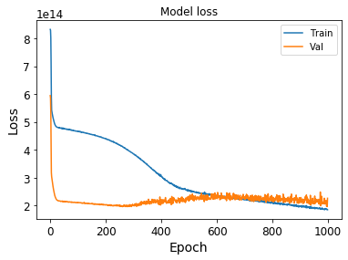
    


#### Deep Learning Model 2


```python
model_2_mse = model_2.evaluate(X_test, Y_test)[0]
model_2_rmse = np.sqrt(model_2_mse)
reduced_num, ten_count = countTens(model_2_rmse)
print("RMSE on test set using Model 2 is: " + str(reduced_num) + " * 10^" + str(ten_count))
```

    216/216 [==============================] - 0s 83us/sample - loss: 141226298135893.3438 - mean_squared_error: 141226292543488.0000
    RMSE on test set using Model 2 is: 1.1883867137253485 * 10^7
    


```python
plt.plot(hist_2.history['loss'])
plt.plot(hist_2.history['val_loss'])
plt.title('Model loss 2')
plt.ylabel('Loss')
plt.xlabel('Epoch')
plt.legend(['Train', 'Val'], loc='upper right')
plt.show()

# below figure doesn't show next 25 epochs. RMSE above was displayed after 25 more epoches (making total epochs = 300)
```


    
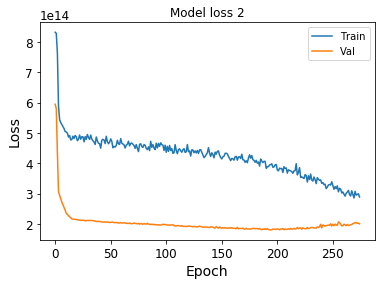
    


### Making Predictions on Validation Set & Custom Input

#### Linear Regression


```python
price_predictions = lin_reg_model.predict(X_val)
lin_reg_mse = mean_squared_error(Y_val, price_predictions)
lin_reg_rmse = np.sqrt(lin_reg_mse)

reduced_num, ten_count = countTens(lin_reg_rmse)
print("RMSE on validation set using Linear Regression is: " + str(reduced_num) + " * 10^" + str(ten_count))
```

    RMSE on validation set using Linear Regression is: 1.0461315529577755 * 10^17
    

#### Decision Tree Regression


```python
price_predictions = tree_reg_model.predict(X_val)
tree_reg_mse = mean_squared_error(price_predictions, Y_val)
tree_reg_rmse = np.sqrt(tree_reg_mse)
reduced_num, ten_count = countTens(tree_rmse)
print("RMSE on validation set using Decision Tree Regression is: " + str(reduced_num) + " * 10^" + str(ten_count))
```

    RMSE on validation set using Decision Tree Regression is: 2.7435425654245926 * 10^7
    

#### Deep Learning Model 1

##### Predictions on Custom Input


```python
#test_data = np.array([1,7.624,33.669341,72.84489,1,1,0,0,0,1,1,1,1,1])
test_data = np.array([1 ,43.560, 33.669341, 72.84489, 1, 1, 0, 0, 0, 1, 1, 1, 1, 1])
print(model_1.predict(test_data.reshape(1,14), batch_size=1))
prediction = model_1.predict(test_data.reshape(1,14), batch_size=1)
print(Y.at[1,"price"])
print(prediction - Y.at[1,"price"])
```

##### Predictions on Validation Set


```python
pred_val = model_1.predict(X_val)
model1_val_rmse = np.sqrt(mean_squared_error(Y_val, pred_val))
reduced_num, ten_count = countTens(model1_val_rmse)
print("RMSE on validation set using model 1 is: " + str(reduced_num) + " * 10^" + str(ten_count))
```

    RMSE on validation set using model 1 is: 1.5026939173212719 * 10^7
    

#### Deep Learning Model 2

##### Predictions on Custom Input


```python
#test_data = np.array([1,7.624,33.669341,72.84489,1,1,0,0,0,1,1,1,1,1])
test_data = np.array([1 ,43.560, 33.669341, 72.84489, 1, 1, 0, 0, 0, 1, 1, 1, 1, 1])
print(model_2.predict(test_data.reshape(1,14), batch_size=1))
prediction = model_2.predict(test_data.reshape(1,14), batch_size=1)
print(Y.at[1,"price"])
print(prediction - Y.at[1,"price"])


##### Predictions on Training Set


```python
pred_val = model_2.predict(X_val)
model2_val_rmse = np.sqrt(mean_squared_error(Y_val, pred_val))
reduced_num, ten_count = countTens(model2_val_rmse)
print("RMSE on validation set using model 2 is: " + str(reduced_num) + " * 10^" + str(ten_count))
```

    RMSE on validation set using model 2 is: 1.424891094928326 * 10^7
    

### Summary of Results

**Note:** These are some baseline results. DL models were not fine-tuned by trying different hyper-parameters. Secondly, different configurations of DL models were not tried at all except for the given models. This work focused on dataset visualization & analysis.
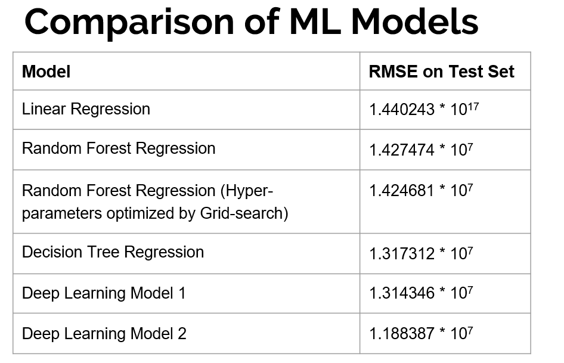

- Random Forests & Decision Trees performed comparable to Deep Learning models. This is because of the nature of the dataset. 
- Deeper DL models can be used for better results along with hyper-parameter tuning. But, significant improvements are not expected (as validated during some experiments) without improving the dataset.

- **Future work** 
    - Work can be done on modifying the dataset according to the analysis given in this notebook. Suggested modifications can help with achieving better results using deep learning models.
    - Deeper DL models can be tried, because moving from model 1 to model 2 showed some progress. Secondly, different layer configurations can be tried along with hyper-parameter tuning.

## Conclusion

- Dataset needs serious improvements. All the future work on this project depends on the dataset. Investing in the dataset can bring significant improvements in the results.
- Most of suggested dataset improvements are not resource-extensive. Latitude & longitude of plots can be used to extract required attributes from the Google Maps. Cost-effective solution can be achieved through Node.js frameworks & Google Maps APIs.
- Without dataset extension & improvement, hyper-parameter tuning & usage of deeper deep learning models may lead to better results.


```python

```
